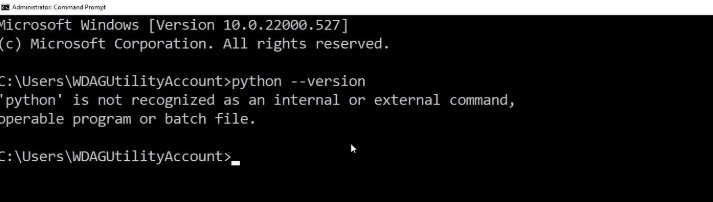
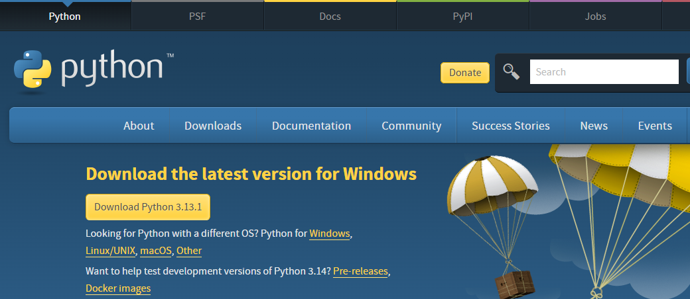

# Task1

## Introduction

Welcome to the Maths Quiz Application! This program is an interactive arithmetic quiz designed to test your basic mental math skills. It displays random arithmetic problems and you earn points by answering them correctly. Whether you’re brushing up on math or having some fun with numbers, this quiz is a great choice.

The program includes a graphical interface using Python’s tkinter library, making it user-friendly and interactive.

## Features

- Randomly generated arithmetic problems (addition, subtraction, multiplication, division)

- A scoring system that tracks your progress

- Immediate feedback for each question (correct / incorrect)

- Displays your final score and percentage at the end of the quiz

- Simple and intuitive interface suitable for all ages

## What you will need

1. Python 3.x installed on your computer

2. The tkinter module (pre-installed with Python in most cases)

3. A basic text editor or an integrated development environment (IDE) to view and run the code e.g vs code

## How to Set Up

### 1. Installing Python

First install python, but before you do this use the following command to check if you already have python installed:

```bash 
python --version
```

Hint: Your terminal can be found by typing cmd in the searchbox (windows) or Click the Launchpad icon in the Dock, type Terminal (MacOS)



If the above is displayed then navigate to python.org and install python!



### 2. Save the file

Save the script with a .py extension (e.g., maths_quiz.py)

### 3. Run the Program

1. Open a terminal or command prompt

2. Navigate to the directory where the script is saved (hint: on windows use the command "dir" to display your current directory - use "cd" to change directory)

3. Run the script using the command:

```bash 
python maths_quiz.py
```

4. The application window will launch and you’re ready to play!


## User Guide

### How to play

1. Once the application launches, the first question will appear in the window

2. Enter your answer in the text field below the question

3. Press Enter or click the Submit button to check your answer

4. If your answer is correct, you’ll see a confirmation message, and your score will increase

5. If your answer is incorrect, the correct answer will be displayed

6. After 10 questions, the quiz ends, and your final score is displayed


## Controls

- Answer Field: Enter your answer to the current question

- Submit Button: Submit your answer for checking

- Keyboard Enter: Alternatively, press Enter to submit your answer


## Example Gameplay


https://github.com/OliXDS/Task1/blob/main/programVid.mp4
